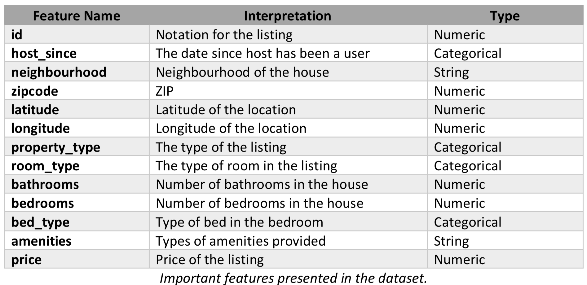

# Airbnb-Price-Prediction
Predicting the daily price of an Airbnb listing

This study uses machine learning algorithms as a research methodology to develop a listing price prediction model. This study analyses the price predictability capability of different algorithms like linear regression, tree based regressions etc. along with other attributes like sparsity, algorithmic complexity etc. The performance of each model is evaluated using four different metrics, the 𝑅" value, mean squared error, mean absolute error and median absolute error.

# Approach

The approach to solve the problem is not to reduce the dimensionality without having a significant idea. We know that location is crucial for Airbnb listing prices and we didn’t want disregard it. One hot encoding the neighborhood and the other categorical features increased the dimensionality of the problem. To reduce it, we used exploratory data analysis to assess which features are significant and which regression methods to use based on exploratory data set.

# Methodology

Split Dataset -> Exploratory Data Analysis -> Data Preprocessing -> Feature Selection -> Parameter and Model Selection -> Performance Evaluation

# Final Results and Interpretation

1. The results of feature selection for the dataset showed that not all the features were necessary. We can introduce sparsity using lasso and ridge regularization and decrease the number of features.
2. The use of regularization has huge impact in improving the performance. This implies that the low performance of linear regression is not due to poor generalization but due to the inherent inability of the chosen model to not fit the data completely.
3. Tree based regressors are fairly simple but they produce noisy & weak regressors. The good thing is they are fairly robust to outliers but the regression accuracy might not as good as other models.
4. Using bagging one can fit many large trees to bootstrap resampled versions of the training data and classify by mean of the each region created.
5. The ability of decision trees to fit nonlinear relationships enables better performance than linear regressor. Boosting techniques enhances this performance.
6. Tuning the parameters, our final model is a Gradient boost regressor with ridge feature selection, with parameters max_depth=4 and n_estimators=200 gives us a good model. We can see that it fairly fits well to the variation of the data by checking the R2 score. The test R2 is fairly close to the training R2 and they are both above 0.5. This is good because Gradient boost regressor tend to overfit the data, in our case it did not. It outperformed all of the other classifiers giving around 25 median absolute error. Thus, this suggests Gradient boost regressor tends to work better with lower dimensional data since our lasso feature selection outputs around 100 features whereas Ridge outputs around 250.
7. Our results suggest that our Linear, Lasso and Ridge Regression algorithms mostly fail to predict the Airbnb price well enough, this is expected since Linear Regression based models are tend to work with linear data. We have lots of categorical features and outliers in our data. Hence, our data is non-linear in it’s nature. Trying to use polynomial regression with a penalizer would work in this case but it was computationally very demanding, so it’s not used.
8. In addition, its seen that the Tree based regressors are fairly simple, but they produce noisy and somewhat weak regressors. The good thing is they are fairly robust to outliers, which we can see from the results of Random Forest and Gradient Boost algorithms. In order to reduce the variance bagging/boosting methods are used to resample from the training data with replacement and average out each resulting model to get a more robust the final model.
9. Using bagging one can fit many large trees to bootstrap resampled versions of the training data and the regression output is the mean of each region created.
10. Using boosting one may fit many large/small trees to reweighted versions of the training data and the regression output is again the mean of the regions created. But, for boosting predictors are made sequentially.
11. Gradient boost is a stage wise additive technique where the original Adaboost problem is posed as an optimization problem, where the loss function is minimized using gradient descent procedure. A possible pitfall for our problem could be Gradient boosting might overfit for our data, but we see that using parameter tuning we are able to find a Gradient boosting regressor gives a fairly good result.
12. We think that main reason behind the other algorithms didn’t give the expected result is the possible outliers in the data. We also see that the exploratory data analysis worked in our favor. Our results from exploratory data analysis matches the results for our main dataset. The best performers in exploratory dataset also worked well with the main dataset.
